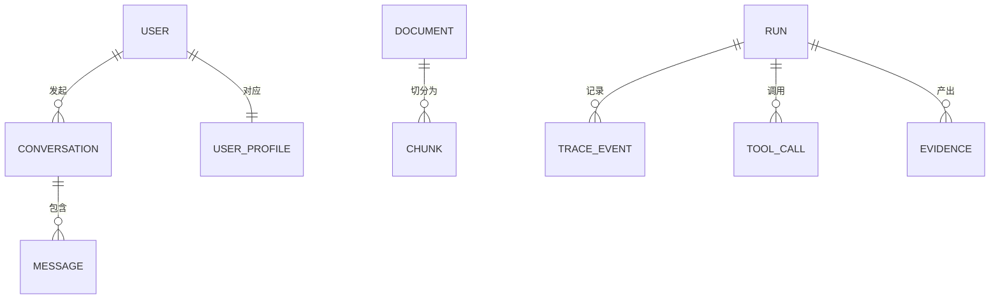

# Domain Model

## 实体关系

## 核心实体

### 用户与对话

| 实体 | 字段 | 说明 |
| --- | --- | --- |
| User | id, username, password(hash), name, role(student/admin), created_at | 用户 |
| UserProfile | id, user_id, preferences(JSON), updated_at | 用户画像（专业/年级/偏好） |
| Conversation | id, user_id, title, created_at, updated_at | 会话 |
| Message | id, conversation_id, role, content, created_at | 消息 |

### 知识（核心创新的落地基础）

| 实体 | 字段 | 说明 |
| --- | --- | --- |
| Document | id, title, category, content, **source, source_authority, publish_date, effective_from, effective_to, version, department, doc_type, scope**, created_at | 知识文档 |
| Chunk | id, document_id, content, embedding_id, created_at | 片段（继承文档元数据） |

**元数据枚举**：

- `source_authority`：校级(4) / 院级(3) / 部门(2) / 未知(1) —— 用于权威加权
- `doc_type`：制度 / 通知 / 流程 / 名单 / 校历 / 其他
- `department`：院系名称或 null（校级适用）
- `scope`：适用范围描述
- `effective_from / effective_to`：生效区间（用于时效过滤）
- `publish_date`：发布时间
- `version`：版本号（区分"2026 规定"与"2024 规定"）

### 执行与观测

| 实体 | 字段 | 说明 |
| --- | --- | --- |
| Run | run_id, request_id, user_id, intent, model, prompt, latency_ms, token_usage, error, final_answer, created_at | 一次完整运行 |
| TraceEvent | id, run_id, step(route/retrieval/tool/agent/generate), input, output, latency_ms | 执行步骤 |
| ToolCall | id, run_id, tool_name, category, args, result, status(ok/error/missing_params), confirm_required, latency_ms | 工具调用 |

### 证据（Evidence / Citation）

| 实体 | 字段 | 说明 |
| --- | --- | --- |
| Evidence | chunk, source_title, source_authority, page, publish_date, effective_from/to, retrieval_score, rerank_score | 支撑回答的证据片段 |
| Citation | 派生自 Evidence（返回前端） | 展示"回答依据" |

## 关键设计

1. **Document/Chunk 的元数据是核心**：时间有效性（temporal）与来源权威性（authority）都落在知识元数据上。
2. **Run/TraceEvent/ToolCall** 构成可观测层，支撑"为什么回答错了"的归因。
3. **Evidence 独立于 answer**：回答始终携带证据链，实现证据一致性 grounding。
