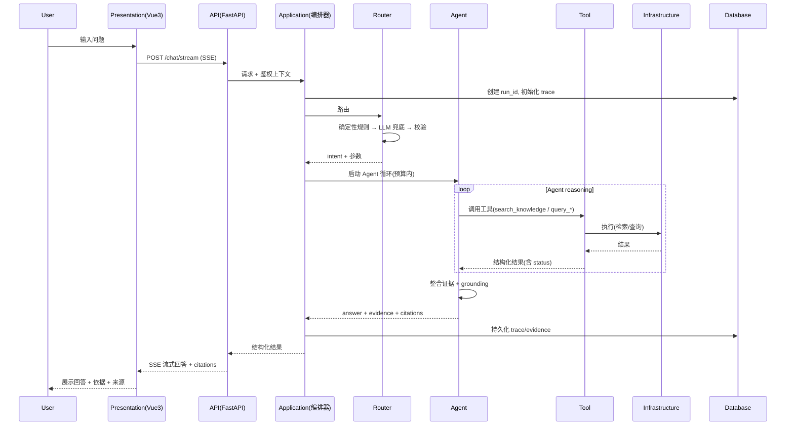

# Request Lifecycle

一次用户请求的完整生命周期，从入口到回答（含证据与 trace）。

## 各步骤说明

| 步骤 | 执行者 | 职责 | 确定性/LLM |
| --- | --- | --- | --- |
| 鉴权 | API | 校验身份、权限 | 确定性 |
| 建 run_id | Application | 初始化 trace | 确定性 |
| 路由 | Router | 意图 + 参数 | 确定性优先，LLM 兜底 |
| Agent 循环 | Agent | 规划、调用工具、整合 | LLM 在边界内决策 |
| 工具执行 | Tool | 检索/查询/澄清 | 确定性 |
| Grounding | Domain | 证据一致性约束 | 确定性 + LLM 生成 |
| Trace 持久化 | Application | 落库 | 确定性 |

## 关键约束

1. **澄清分支**：工具缺参数时返回 `missing_params`，由 Application 触发澄清流程，而非编造。
2. **预算**：Agent 循环有步数/token 上限，防止死循环。
3. **失败降级**：检索失败→改写重试(≤N)→仍失败则明说"不确定，建议人工确认"。
4. **trace 贯穿**：每步都记录，便于归因。
