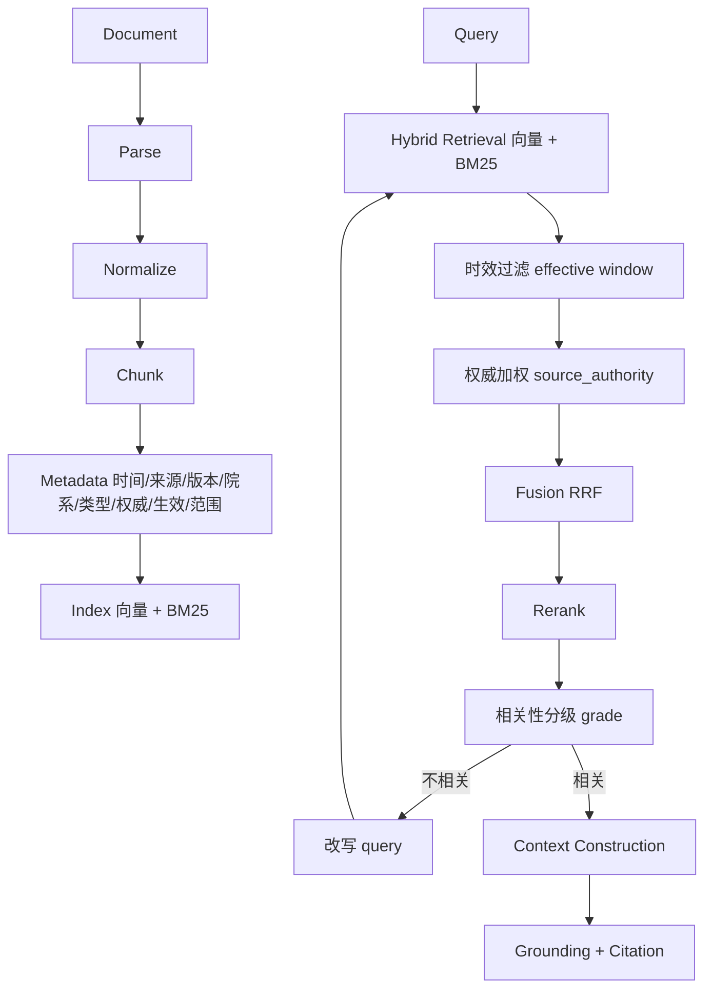

# Retrieval Architecture

面向校园时效性知识的权威感知检索管线。

## 全链路

## 关键设计：时间有效性与来源权威性

这是核心创新的两大支柱，落在**元数据 + 检索策略**上：

### 时间有效性（Temporal Validity）

- Document/Chunk 带 `publish_date`、`effective_from`、`effective_to`、`version`。
- 检索时：
  1. **过滤**：`effective_to` 已过期且无更新版本的文档降权或排除；
  2. **版本归并**：同一主题存在多版本时，优先最新版本（"2026 规定"压过"2024 规定"）；
  3. **标注**：返回给 LLM 的上下文带时间标注，供 grounding。

### 来源权威性（Source Authority）

- Document 带 `source_authority`（校级4 / 院级3 / 部门2 / 未知1）。
- 检索融合时按权威等级加权：同一语义相似度下，权威来源优先。
- 引用返回权威等级，前端可展示"来源：教务处（校级）"。

### 证据一致性（Evidence Grounding）

- 检索结果转为 `Evidence`（含来源/权威/时间/得分）。
- 生成阶段强制"答案必须基于 evidence，无证据则明说"。
- 相关性分级（grade）自校正：不相关→改写重试。

## 索引与存储

| 组件 | 职责 | 边界 |
| --- | --- | --- |
| Embedding | 文本向量化（bge-small-zh） | Infrastructure |
| VectorStore | 向量存储/检索（Chroma） | Infrastructure |
| BM25 | 关键词检索（rank_bm25） | Infrastructure |
| Retriever | 编排：混合→过滤→加权→融合 | Domain |
| Reranker | 交叉编码重排（bge-reranker） | Infrastructure |
| Grounding/Citation | 证据组装 | Domain |

## 待验证的指标

- Retrieval Recall / Precision
- Rerank effectiveness
- Citation correctness（引用是否正确对应答案依据）
- hallucination rate（无证据却给出确定答案的比例）
